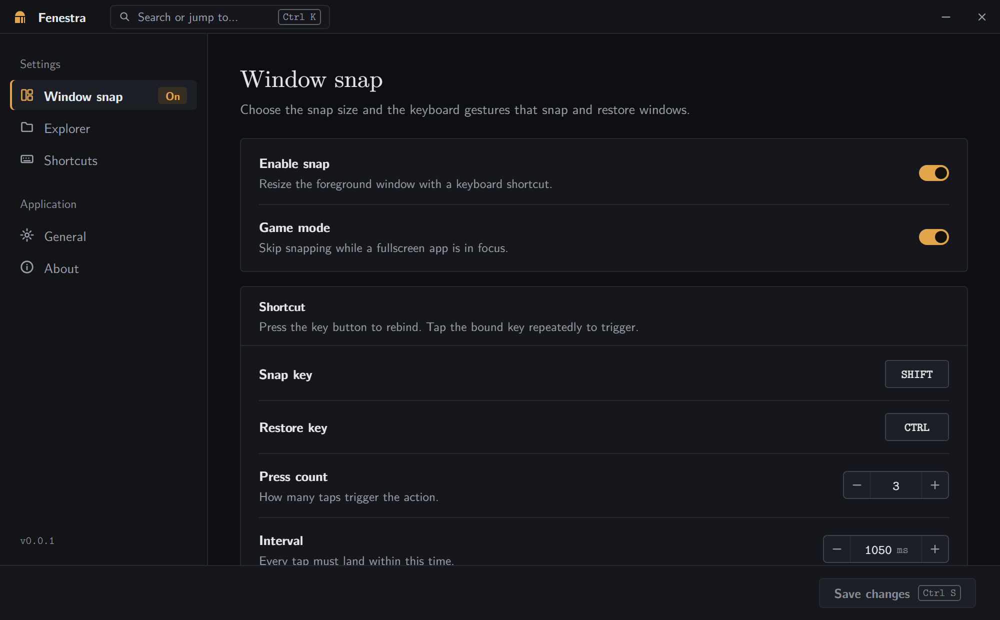

# Fenestra

Fenestra is a Windows tray utility that snaps the foreground window to a set
size at the center of its monitor and fits File Explorer's Details columns to
their contents as you browse.



## Install

Fenestra runs on x64 Windows 10 version 1809 or later and on Windows 11 ARM64
through x64 emulation. Build the installer as described in
[Releasing](docs/releasing.md), then run
`installer\dist\FenestraSetup-<version>-x64.exe`.

Fenestra asks for administrator approval each time it starts, because its global
keyboard hook and its moves of other applications' windows require elevation.
Turn on **Launch at login** to start it elevated at sign-in without a prompt.

## Use

| Action                     | Default gesture                          |
| -------------------------- | ---------------------------------------- |
| Snap the foreground window | Tap Shift three times within 1,050 ms.   |
| Restore the snapped window | Hold Ctrl and tap Shift three times.     |
| Open the command palette   | Press Ctrl+K in the Fenestra window.     |
| Snap the window behind it  | Press Ctrl+Enter in the Fenestra window. |

A snap resizes the window to 76 percent of the width and height of its monitor's
work area and centers it. A window that cannot be resized is centered at its
current size. A restore returns the window to its size before the snap, centered
on its current monitor. **Game mode** leaves fullscreen windows alone. The keys,
the press count, the interval, and the size are set on the **Window snap** page.

The Fenestra window has a fixed size and moves by its title bar. The snap
gesture centers it on its monitor, and it also centers itself again after the
display scale changes.

On the **Explorer** page, **Auto-size columns on folder change** fits the
columns of every Details view each time a folder opens. **Make Details the
default** applies Details view to every folder, and **Reset folder views**
returns them to the Windows defaults. Both back up the current views, keep the
desktop's icon size and arrangement, and restart File Explorer.

Closing the window keeps Fenestra in the notification area while **Minimize to
tray** is on. Starting Fenestra again while it runs shows the existing window.
Settings are stored under `HKCU\Software\Yusuf Qwareeq\Fenestra`, and the log
and folder-view backups are in `%LOCALAPPDATA%\Fenestra`.

## Develop

Development requires official x64 CPython 3.13 and x64 Node.js 24 LTS on
Windows. From the repository root:

```powershell
$python = "C:\Path\To\Python313\python.exe"
$node = "C:\Path\To\nodejs\node.exe"
.\scripts\bootstrap.ps1 -PythonExecutable $python -NodeExecutable $node
.\scripts\build-installer.ps1 -PythonExecutable $python -NodeExecutable $node
.\scripts\verify-release.ps1
```

[Development](docs/development.md) covers the development server, the checks
that must pass before a commit, and the architecture.

## Documentation

| Document                                   | Scope                                              |
| ------------------------------------------ | -------------------------------------------------- |
| [Development](docs/development.md)         | Setup, development mode, checks, and architecture. |
| [Releasing](docs/releasing.md)             | Version, build, verification, and tagging.         |
| [Troubleshooting](docs/troubleshooting.md) | Runtime and build failures.                        |

## License

Fenestra is available under the [MIT License](LICENSE). The bundled WebCM fonts
are under the GUST Font License; see
[their notice](frontend/src/assets/fonts/README.md).
